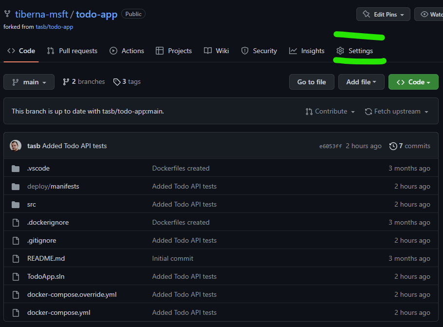

# Lab 10: Start using your repo

## Table of Contents

- [Objectives](#objectives)
- [Pre-requisites](#pre-requisites)
- [Guide](#guide)
  - [Step 01: Create git repo in GitHub](#step-01-create-git-repo-in-github)
  - [Step 02: Enforce Pull Request Usage](#step-02-enforce-pull-request-usage)
  - [Step 03: Clone your repo](#step-03-clone-your-repo)
  - [Step 04: Create a new branch](#step-04-create-a-new-branch)
  - [Step 05: Add Code](#step-05-add-code)
  - [Step 06: Push your branch to GitHub](#step-06-push-your-branch-to-github)
  - [Step 07: Create Pull Request](#step-07-create-pull-request)
  - [Step 08: Clean Up Local Repo](#step-08-clean-up-local-repo)
- [Conclusion](#conclusion)

## Objectives

- Create a new repo on GitHub
- Configure a new repo to use Pull Requests
- Create a Pull Request
- Complete a Pull Request
- Clean up your local repo to be ready for new developments

## Pre-requisites

- [ ] Have a GitHub account
- [ ] Have Git installed on your machine

## Guide

### Step 01: Create git repo in GitHub

Navigate to [GitHub](https://github.com) and login with your credentials.

Click on the `Repositories` option on top menu and then on green button wit name `New`.

On the new screen, fill the following details:

- Repository name: `git-training`
- Description: `Repository to learn Git basics`
- Public
- Add a README file
- Add a .gitignore file: `Ansible`

Then click on `Create repository` green button.

Now you have a new repo on GitHub!

## Step 02: Enforce Pull Request Usage

Before start using your repo, let's add some policies to enforce Pull Requests on `main` branch and enable Issues on your repo.

Click on `Settings` option on tool bar as shown on next image.



On main screen, check the `Issues` option to enable GitHub Issues on your repo.


Next navigate to `Branches` option available on the left side option, under block `Code and Automation`. On that screen click on `Add rule` button as shown on next image.


On new screen, add `main`on `Branch name pattern`. This option will enable this policy on `main` branch, meaning that all merges (updates) on that branch must came from a Pull Request.

You need to enable the option `Require a pull request before merging` to enable the policy. You need to **disable** `Required approvals` option, since you're the only user on that repo and by default, GitHub don't allow that the creator of a pull request can approve his own changes.

At the end, your rule must have the following details.


After making this configuration, you need to click on `Create` green button on the bottom of this page. You may need to enter again your password to confirm this change. After you do that you must see a similar screen like the one below.


Now you're ready to change your code!

### Step 03: Clone your repo

Now that you have your repo ready to use, you need to clone it to your local machine to start working on it.

Navigate to your repo on GitHub and click on the green button `Code` and copy the URL to clone your repo.


Now, open your terminal and navigate to the folder where you want to clone your repo.

```bash
git clone <URL>
```

After cloning your repo, navigate to the folder created with the name of your repo.

```bash
cd git-training
```

Now you're ready to start working on your repo!

### Step 04: Create a new branch

Before start working on your repo, you need to create a new branch to work on your changes. This is a good practice to keep your `main` branch clean and ready to be used on production.

```bash
git checkout -b topic/add-ansible-code
```

This command will create a new branch named `topic/add-ansible-code` and move you to that branch.

### Step 05: Add Code

Copy the code you produced on [Lab 06](lab-06.md) to your local repo.

Now let's add the code to your repo.

```bash
git add -A
```

And commit your changes.

```bash
git commit -m "Add Ansible code to install Redis, PostgreSQL and Apache"
```

### Step 06: Push your branch to GitHub

Now that you have your code on your local repo, you need to push it to your GitHub repo.

```bash
git push
```

With this command you'll get an error since you're trying to push a new branch to your remote repo. You need to follow the instructions on the error message to push your branch to your remote repo.

```bash
git push --set-upstream origin topic/add-ansible-code
```

Now navigate to your repo on GitHub and you'll see that you have a new branch available to be merged to `main` branch.

### Step 07: Create Pull Request

To create your pull request, click on the button `Compare & pull request` on the banner on top of your repo.

On this particular case, we only want to update `main` branch on our repo, so you need to reflect that on the target branch.

You may check that the title of your pull request is already set with you commit message.

You may see that on the `Files changed` tab.

Let's proceed clicking on `Create pull request` button to get access to additional details. As soon as your pull request starts, you may see that some checks are done.

For now, is only merge conflict. Pull requests automatically check if a merge conflict may arise if you do the merge. If so, you're not able to finish your pull request.

Now you are ready to complete your Pull Request and do the merge to the `main` branch. As stated before, on this lab we are not able to add reviewers since your doing this steps alone and GitHub don't allow you to approve your own changes.

Click on `Merge Pull Request` green button, you may leave or update the message that will be added to the merge commit you're about to perform and click on `Confirm Merge`

Because you created a topic branch that is a short-lived branch, you may (let say, must... :)) delete your branch to keep your branch list clean.

You have that option directly after merge is completed so click on the button `Delete Branch`.

### Step 08: Clean Up Local Repo

You already clean up your remote repo but due to Git being a distributed version control system, your local repo didn't received any change automatically.

First step, is to move again to `main` branch.

```bash
git checkout main
```

Now you need to update your branch with the last merge performed on remote side through Pull Request.

```bash
git pull
```

Last step is to keep your repo clean and ready to develop another improvement your code base. For that you need to delete the branch created to update main page title.

```bash
git branch -d topic/add-ansible-code
```

And it's done! You may repeat this process any time you need to change or add new code to your repo.

## Conclusion

You've successfully completed this lab! Now you may feel more prepared to use Git repos and Pull Request on your projects!
